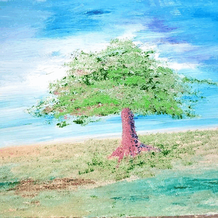

<html lang="en">
<head>
    <meta charset="UTF-8">
    <meta name="viewport" content="width=device-width, initial-scale=1.0">
    <title>JFeelgood - Transform Through Art</title>
    
</head>
<body>
    <!-- Navigation -->
    <nav style="background: white; box-shadow: 0 2px 10px rgba(0,0,0,0.05); position: sticky; top: 0; z-index: 1000;">
        

            <a href="index.html" style="font-size: 1.5rem; font-weight: 600; color: var(--text-dark); text-decoration: none;">JFeelgood</a>
            

                <a href="index.html" style="color: var(--text-dark); text-decoration: none; transition: color 0.3s;">Home</a>
                <a href="assets/images/prints.html" style="color: var(--text-dark); text-decoration: none; transition: color 0.3s;">Art Prints</a>
                <a href="#book-feature" style="color: var(--text-dark); text-decoration: none; transition: color 0.3s;">Book</a>
                <a href="#artist-bio" style="color: var(--text-dark); text-decoration: none; transition: color 0.3s;">About</a>
                <a href="#email-capture" class="btn" style="padding: 10px 20px;">Subscribe</a>
            

        

    </nav>

 

    <!-- Sticky CTA Bar -->
    

        

            
<strong>Transform your perspective.</strong> Join our community for exclusive art insights.

            <form onsubmit="handleEmailSubmit(event, 'sticky')">
                <input type="email" placeholder="Enter your email" required>
                <button type="submit" class="btn">Subscribe</button>
            </form>
        

    

    <!-- Hero Section -->
    <section class="hero">
        

        

            <h1>Transform Through Art</h1>
            
Discover the intersection of creativity, self-discovery, and visual storytelling. Welcome to a journey of personal transformation through the power of artistic expression.

            <a href="#email-capture" class="btn">Start Your Journey</a>
        

    </section>

    <!-- Email Capture Section -->
    <section class="email-capture" id="email-capture">
        

            

                <h2>Join the Community</h2>
                
Get exclusive access to new artwork, inspiration for personal growth, and insights into the creative process.

                <form onsubmit="handleEmailSubmit(event, 'main')">
                    

                        <input type="email" placeholder="Your email address" required>
                        <button type="submit" class="btn">Subscribe Now</button>
                    

                </form>
                

                    Thank you for subscribing! Check your email for confirmation.
                

            

        

    </section>

    <!-- Book Feature Section -->
    <section class="book-feature" id="book-feature">
        

            

                

                    

                        Thought Entropy
                    

                

                

                    <h2>Thought Entropy</h2>
                    
A transformative exploration of chaos, creativity, and the human condition. Thought Entropy invites you to embrace the beautiful disorder of your inner world and channel it into purposeful action.

                    
Through powerful narratives and profound insights, discover how disorder can become your greatest source of creative energy and personal growth.

                    <a href="https://www.amazon.com" target="_blank" class="btn">Buy on Amazon</a>
                

            

        

    </section>

    <!-- Featured Art Prints -->
    <section class="prints-gallery" id="prints-gallery">
        

            <h2 class="section-title">Featured Art Prints</h2>
            

                

                    
Ethereal Dreams

                    

                        <h3>Ethereal Dreams</h3>
                        
$125

                    

                

                

                    
Inner Cosmos

                    

                        <h3>Inner Cosmos</h3>
                        
$150

                    

                

                

                    
Transformation

                    

                        <h3>Transformation</h3>
                        
$135

                    

                

                

                    
Mindful Chaos

                    

                        <h3>Mindful Chaos</h3>
                        
$140

                    

                

            

            

                <a href="#" class="btn">Browse Full Print Shop</a>
            

        

    </section>

    <!-- Artist Bio -->
    <section class="artist-bio" id="artist-bio">
        

            

                

                

                    <h2>About the Artist</h2>
                    
JFeelgood is an artist dedicated to exploring the depths of human consciousness through visual storytelling. With a focus on personal transformation and self-discovery, each piece invites viewers to confront their own inner landscapes.

                    
Inspired by the philosophy that chaos can become creation, and that our struggles can transform into our greatest strengths, JFeelgood's work bridges the gap between abstract expression and tangible emotional resonance.

                    
<strong>Mission:</strong> To inspire personal transformation through art that speaks to the universal human experience of growth, struggle, and ultimately, triumph.

                    

                        <a href="https://instagram.com" target="_blank" class="social-icon" title="Instagram">
                            <svg width="20" height="20" fill="currentColor" viewBox="0 0 24 24">
                                <path d="M12 2.163c3.204 0 3.584.012 4.85.07 3.252.148 4.771 1.691 4.919 4.919.058 1.265.069 1.645.069 4.849 0 3.205-.012 3.584-.069 4.849-.149 3.225-1.664 4.771-4.919 4.919-1.266.058-1.644.07-4.85.07-3.204 0-3.584-.012-4.849-.07-3.26-.149-4.771-1.699-4.919-4.92-.058-1.265-.07-1.644-.07-4.849 0-3.204.013-3.583.07-4.849.149-3.227 1.664-4.771 4.919-4.919 1.266-.057 1.645-.069 4.849-.069zm0-2.163c-3.259 0-3.667.014-4.947.072-4.358.2-6.78 2.618-6.98 6.98-.059 1.281-.073 1.689-.073 4.948 0 3.259.014 3.668.072 4.948.2 4.358 2.618 6.78 6.98 6.98 1.281.058 1.689.072 4.948.072 3.259 0 3.668-.014 4.948-.072 4.354-.2 6.782-2.618 6.979-6.98.059-1.28.073-1.689.073-4.948 0-3.259-.014-3.667-.072-4.947-.196-4.354-2.617-6.78-6.979-6.98-1.281-.059-1.69-.073-4.949-.073zm0 5.838c-3.403 0-6.162 2.759-6.162 6.162s2.759 6.163 6.162 6.163 6.162-2.759 6.162-6.163c0-3.403-2.759-6.162-6.162-6.162zm0 10.162c-2.209 0-4-1.79-4-4 0-2.209 1.791-4 4-4s4 1.791 4 4c0 2.21-1.791 4-4 4zm6.406-11.845c-.796 0-1.441.645-1.441 1.44s.645 1.44 1.441 1.44c.795 0 1.439-.645 1.439-1.44s-.644-1.44-1.439-1.44z"/>
                            </svg>
                        </a>
                        <a href="https://facebook.com" target="_blank" class="social-icon" title="Facebook">
                            <svg width="20" height="20" fill="currentColor" viewBox="0 0 24 24">
                                <path d="M24 12.073c0-6.627-5.373-12-12-12s-12 5.373-12 12c0 5.99 4.388 10.954 10.125 11.854v-8.385H7.078v-3.47h3.047V9.43c0-3.007 1.792-4.669 4.533-4.669 1.312 0 2.686.235 2.686.235v2.953H15.83c-1.491 0-1.956.925-1.956 1.874v2.25h3.328l-.532 3.47h-2.796v8.385C19.612 23.027 24 18.062 24 12.073z"/>
                            </svg>
                        </a>
                        <a href="https://twitter.com" target="_blank" class="social-icon" title="Twitter">
                            <svg width="20" height="20" fill="currentColor" viewBox="0 0 24 24">
                                <path d="M23.953 4.57a10 10 0 01-2.825.775 4.958 4.958 0 002.163-2.723c-.951.555-2.005.959-3.127 1.184a4.92 4.92 0 00-8.384 4.482C7.69 8.095 4.067 6.13 1.64 3.162a4.822 4.822 0 00-.666 2.475c0 1.71.87 3.213 2.188 4.096a4.904 4.904 0 01-2.228-.616v.06a4.923 4.923 0 003.946 4.827 4.996 4.996 0 01-2.212.085 4.936 4.936 0 004.604 3.417 9.867 9.867 0 01-6.102 2.105c-.39 0-.779-.023-1.17-.067a13.995 13.995 0 007.557 2.209c9.053 0 13.998-7.496 13.998-13.985 0-.21 0-.42-.015-.63A9.935 9.935 0 0024 4.59z"/>
                            </svg>
                        </a>
                    

                

            

        

    </section>

    <!-- Footer -->
    <footer>
        

            

                

                    <h3>JFeelgood</h3>
                    
Transforming perspectives through art and self-discovery.

                

                

                    <h3>Quick Links</h3>
                    <a href="#email-capture">Subscribe</a>
                    <a href="#book-feature">Thought Entropy</a>
                    <a href="#prints-gallery">Art Prints</a>
                    <a href="#artist-bio">About</a>
                

                

                    <h3>Stay Connected</h3>
                    
Join our mailing list for exclusive content and updates.

                    <form onsubmit="handleEmailSubmit(event, 'footer')">
                        

                            <input type="email" placeholder="Your email" required style="flex: 1; padding: 10px; border: none; border-radius: 4px;">
                            <button type="submit" class="btn" style="padding: 10px 20px;">Join</button>
                        

                    </form>
                    

                        Thank you for subscribing!
                    

                

            

            

                
&copy; 2025 JFeelgood. All rights reserved. | <a href="#" style="color: inherit;">Privacy Policy</a>

            

        

    </footer>

    
</body>
</html>
