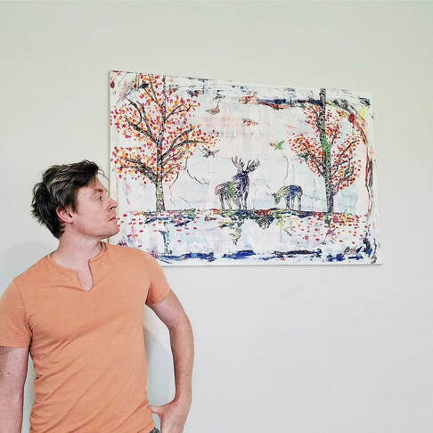
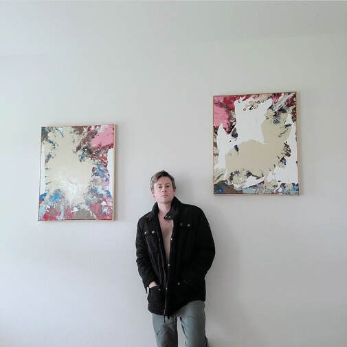

<!-- Navigation with anchor links to sections -->
<nav class="landing-nav">
  <ul>
    <li><a href="#hero">Home</a></li>
    <li><a href="#about">About</a></li>
    <li><a href="#featured">Featured Work</a></li>
    <li><a href="#gallery">Gallery & Shop</a></li>
    <li><a href="#contact">Contact</a></li>
  </ul>
</nav>

<!-- HERO SECTION -->
<section id="hero" class="hero-banner" style="padding-top:4em;">
  <h2>Discover Unique, Original Art Pieces by JFeelgood</h2>
  
Elevate your space with one-of-a-kind creations.

  <a class="cta-button" href="#gallery">Explore Gallery</a>
  
</section>

<!-- ABOUT SECTION -->
<section id="about">
  <h1>About JFeelgood</h1>
  

  

    JFeelgood is an accomplished artist with over 18 years of experience in various mediums. He has produced a substantial body of work, including several hundred paintings, five published books, five music albums, and a video game. In addition to his own artistic pursuits, JFeelgood has also organized community events and served in leadership roles for various art organizations. He is dedicated to using his art as a means of self-expression and has a strong passion for helping others explore their own creative gifts. JFeelgood's relationship with art is central to his life and he continues to seek new ways to enrich this connection through life experiences and experimentation with new mediums.
  

  <h3>What Collectors Are Saying:</h3>
  <blockquote>
    
"JFeelgood’s work brings a new dimension to my living space. Each piece is more than just art—it’s a conversation starter." 
    — Sarah M., Austin, TX

  </blockquote>
  <blockquote>
    
"The quality of the prints is outstanding. The colors are as vibrant as the originals, and the paper is top-notch." 
    ​— Michael P., New York, NY

  </blockquote>
  

</section>

<!-- FEATURED WORK SECTION -->
<section id="featured">
  <h2>Featured Work</h2>
  

    <!-- Dynamically render all 153 images -->
    
      
      

        
      

    
  

</section>

